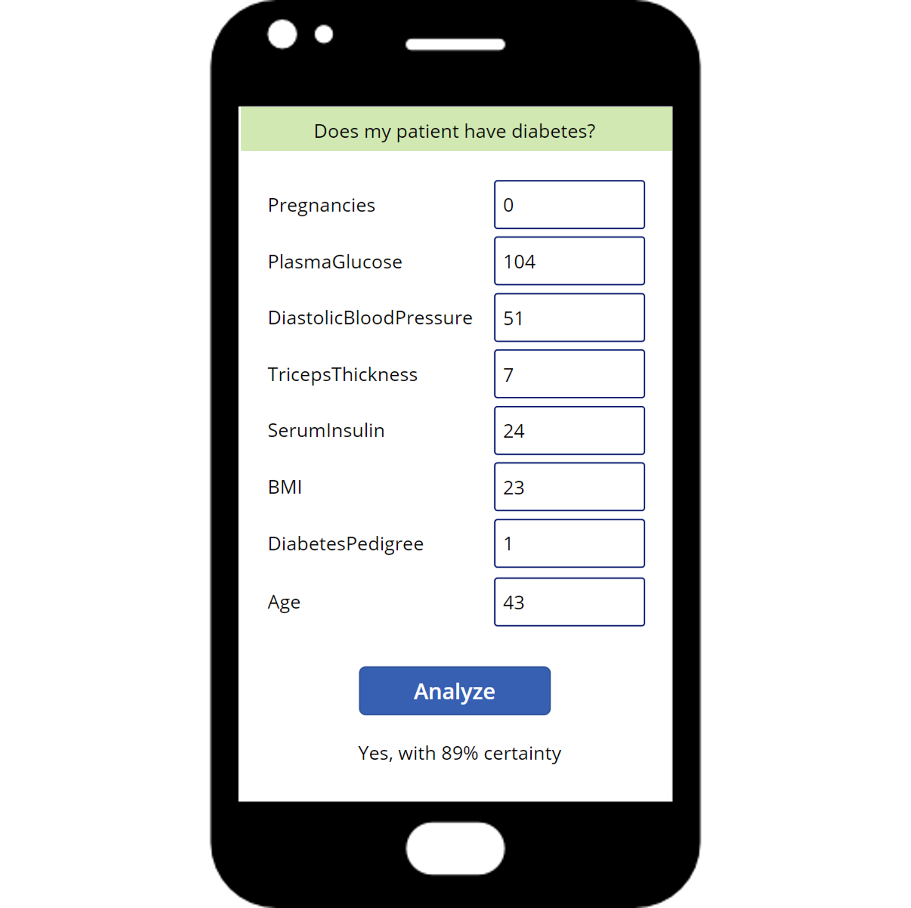

# Give advice on how to ingest and serve the data

Thank you for helping us decide how best to extract, load, and transform the data we need to train a model!

At Proseware, we are developing an app that will help doctors diagnose diseases in patients faster. A doctor or nurse can enter the patient's medical data into the app. The app will quickly analyze the data and should then tell the user if the patient should be further screened for diabetes.

Now, we need your help! 

<button class="button" onclick="document.getElementById('id01').style.display='block'">Ask: What does this button do?</button>

  
Remember you can click the green <b>Ask</b> button to get more information about the use case. You can choose how much extra information you need to answer each question.

# Are you ready?

<button class="answerbutton" onclick="window.location.href='02';">Start</button>

<i>All progress will be lost when you reset the game.</i>

<button class="resetbutton" onclick="window.location.href='../start-01-data';">Reset game and go back to start</button>
