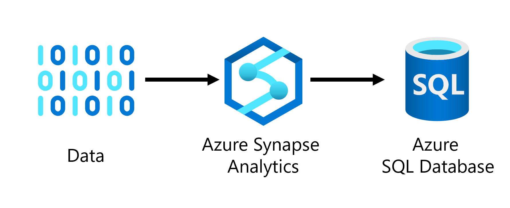
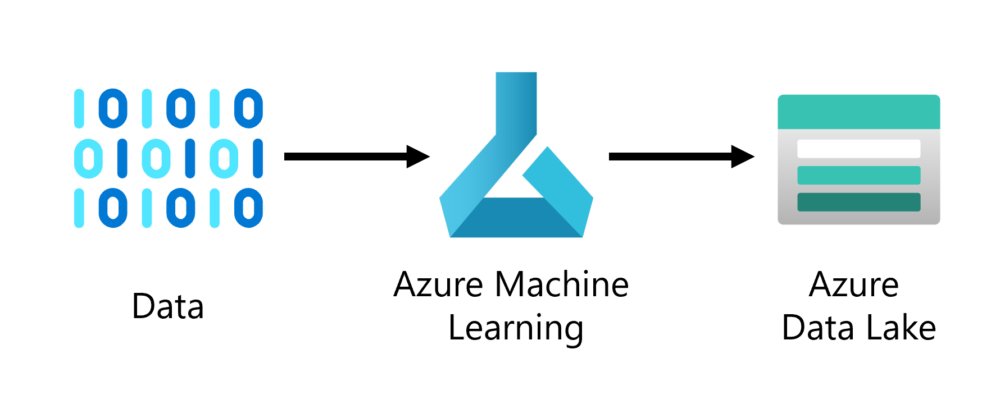
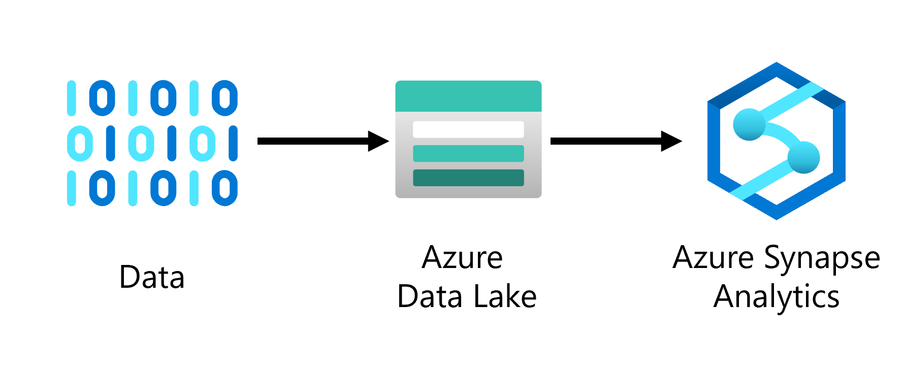
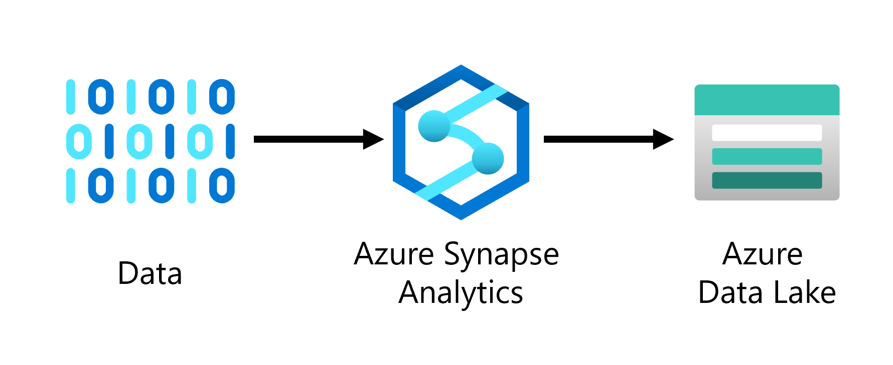

## Great!

Let's stick with Azure Synapse Analytics indeed. We can connect to the patient database, perform any necessary transformations, and move the data to the Azure Data Lake. Anyone will be able to configure the transformations using the easy-to-use mapping data flow in Azure Synapse Analytics. 

Seems like we have the answers we need. It'd be good to have an overview of what we discussed.

### Get more information
Need to know more before you can give advice? Select a question below to find out more about the use case. **Remember you can only ask one question, so choose wisely!**

 

How do you want to use the model?

We're thinking of integrating the model with an application which will be used by health care practitioners. The user will be able to enter a patient's medical information and find out almost instantly whether the patient is likely to have diabetes yes or no.

 

Is the data already processed?

The data you'll get for initial model development is anonymized and a small sample of the actual data we'll use to train the model we want to integrate with our solution. The data you'll get is already cleaned and contains no missing data. We have a data transformation pipeline in Azure Synapse Analytics set up which already processes the data.

 

How much data do you have?

We'll initially test the idea with a small anonymized dataset of 10000 rows. The medical data we work with is privacy-sensitive so initial development should happen on the small dataset instead of the actual production dataset which the data scientists should not get access to.

Once you're ready to give advice, select the most optimal answer to the question below.

## Which architecture represents the proposed data ingestion solution?

 

<button class="button" onclick="window.location.href='06A';">
  
</button>

 

<button class="button" onclick="window.location.href='06A';">
  
</button>

 

<button class="button" onclick="window.location.href='06A';">
  
</button>

 

<button class="button" onclick="window.location.href='06A';">
  
</button>

 

<i>All progress will be lost when you reset the game.</i>

<button class="resetbutton" onclick="window.location.href='../start-01-data';">Reset game and go back to start</button>

