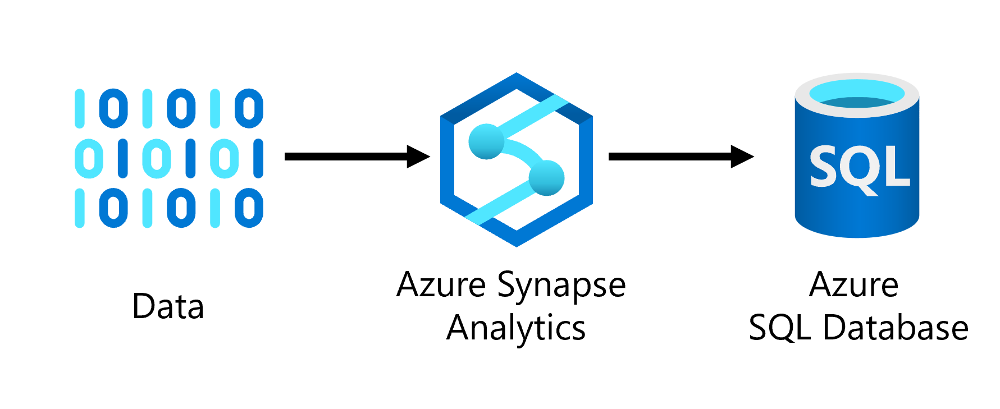
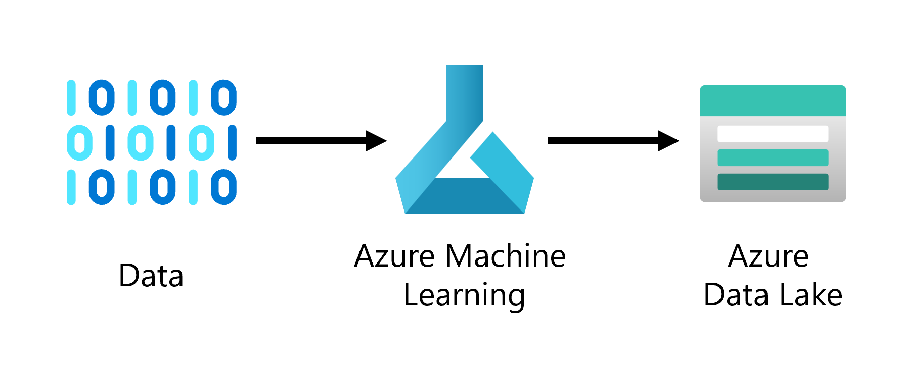

### Question 5/5

# Which architecture represents the proposed data ingestion solution?

It'd be good to have an overview of all the decisions we discussed.

 

Open hint 1

We decided to store the data in a Azure Data Lake Storage.

Open hint 2

We decided to ingest the data with Azure Synapse Analytics.

Open hint 3

The icon for an Azure Data Lake Storage is:

The icon for Azure Synapse Analytics is:

## Select your answer:

 

<button class="answerbutton" onclick="window.location.href='06B';">
  
</button>

 

<button class="answerbutton" onclick="window.location.href='06B';">
  
</button>

 

<button class="answerbutton" onclick="window.location.href='06B';">
  
</button>

 

<button class="answerbutton" onclick="window.location.href='06A';">
  
</button>

 

<i>All progress will be lost when you reset the game.</i>

<button class="resetbutton" onclick="window.location.href='../start-01-data';">Reset game and go back to start</button>
