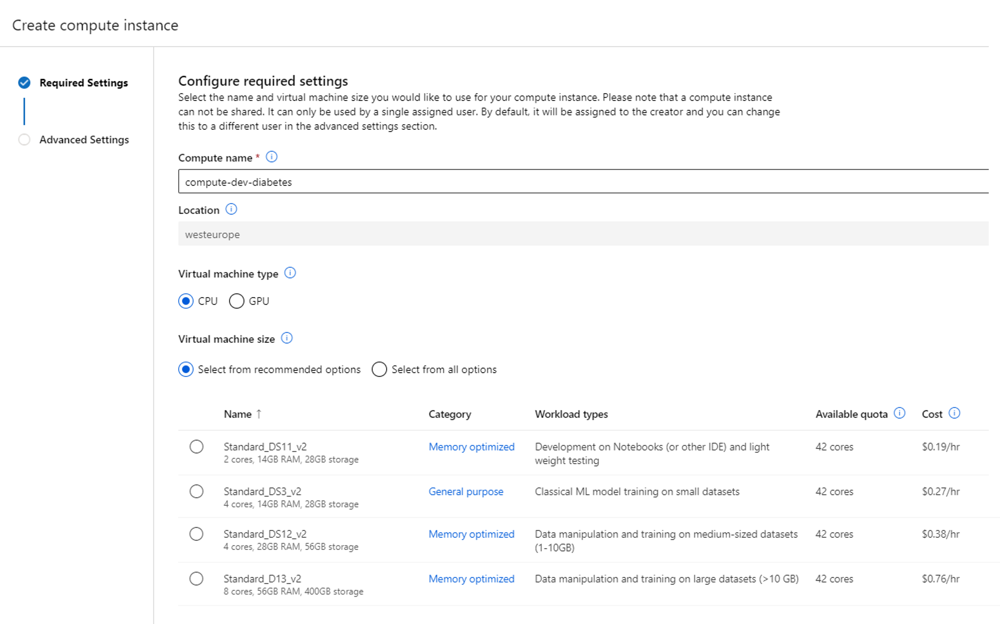

### Question 5/5

# Which virtual machine size would you recommend to train the model?

We'll create an Azure Machine Learning workspace for our data science team. We'll also create the compute instance, and give the data scientists access to the compute instance. 

That way, they don't need additional access and can't go rogue and create more compute instances that may be unnecessary. Our data scientists can let us know when they need more compute and our administrator will create the compute for them.

We need one more detail from you to create the compute instance. There seem to be several sizes available. 

 

 

Open hint 1

The data scientists should initially test the idea with a small anonymized dataset of 10 000 rows. The medical data we work with is privacy-sensitive so initial development should happen on the small dataset instead of the actual production dataset, which the data scientists should not get access to.

Open hint 2

Remember our data scientists will initially work with Jupyther notebooks.

Open hint 3

When running the cells in a Jupyter notebook, outputs and objects are stored in memory. We therefore need a high memory-to-CPU ratio to optimize the notebook performance for our data scientists.

## Select your answer:

<button class="answerbutton" onclick="window.location.href='06A';">Standard DS11 v2</button>

<button class="answerbutton" onclick="window.location.href='06B';">Standard DS3 v2</button>

<button class="answerbutton" onclick="window.location.href='06B';">Standard DS12 v2</button>

<button class="answerbutton" onclick="window.location.href='06B';">Standard D13 v2</button>

<i>All progress will be lost when you reset the game.</i>

<button class="resetbutton" onclick="window.location.href='../start-02-training';">Reset game and go back to start</button>
