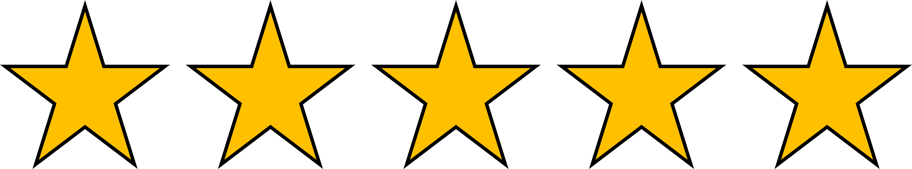

# Correct!

# We're ready to go!

To minimize cost and effort, Azure Cognitive Services offer Custom Vision to train a custom computer vision model. Any of our data scientists can use Custom Vision to quickly develop a prototype for the skin detection model.

If the prototype of the model proves to be successful, we can decide to invest more time and effort to take the model to the next level.

It seems we have a good plan to move forward and give our data scientists the tools they need to be productive!

## Do you want to get started?

[Learn how to train a model with Azure Machine Learning](https://learn.microsoft.com/learn/modules/train-local-model-with-azure-mls/)

### Do you want to do another dialog exercise?

<button class="resetbutton" onclick="window.location.href='https://microsoftlearning.github.io/mslearn-aml-design/';">Back to overview of dialog exercises</button>
