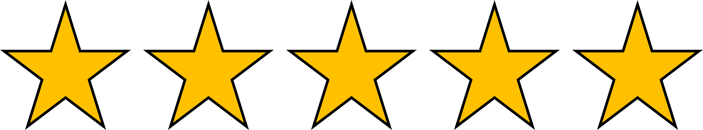

# Correct!

# We're ready to go!

Now that we know how to ingest data, we're future-proof! Let's get that large anonymized dataset into the Azure Data Lake, and our data scientists can use the data to train a diabetes classification model.

## Do you want to get started?

[Learn how to perform code-free transformation at scale with Azure Synapse Analytics](https://learn.microsoft.com/training/modules/code-free-transformation-scale/)

### Do you want to do another dialog exercise?

<button class="resetbutton" onclick="window.location.href='https://microsoftlearning.github.io/mslearn-aml-design/';">Back to overview of dialog exercises</button>
