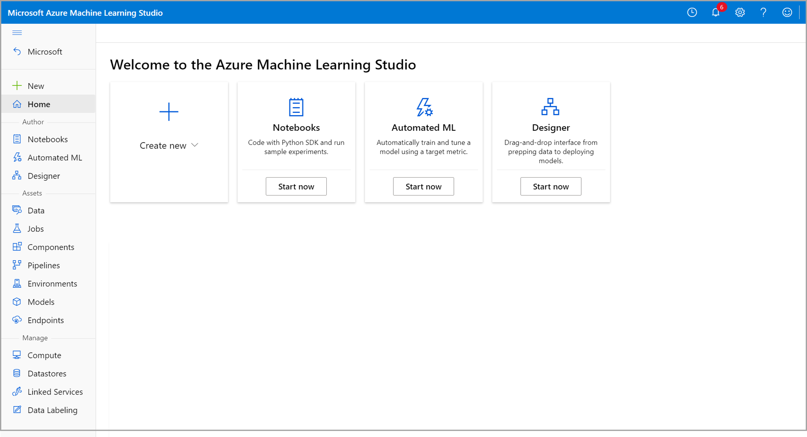

# Game: Design architecture

## You chose: Azure Machine Learning

**Azure Machine Learning** sounds like it could be a good way to get our data scientists to work in the cloud. Let's have a look at the service and explore what the data scientists can use. 

## Which feature within Azure Machine Learning could the data science team use for experimentation?

> [Notebooks](../Q2/01.md)

> [Automated Machine Learning](../Q2/02.md)

> [Designer](../Q2/03.md)

