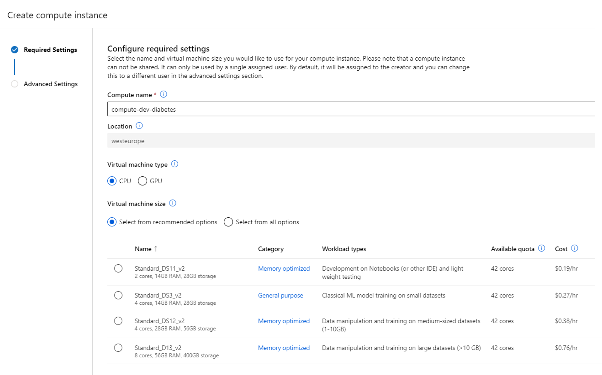

## Great!

A compute instance seems ideal for experimentation and we don't really need those expensive GPUs. 

We'll create an Azure Machine Learning workspace for our data science team. We'll also go ahead and create that compute instance and we'll give the data scientists access to the compute instance. By doing so, they won't need more access rights and won't be able to go rogue and create more compute which may be unnecessary. Just let us know when you need more compute and we'll ask our administrator to create it for you.

We need one more detail from you to create the compute instance. There seem to be several sizes available. 

### Get more information
Need to know more before you can give advice? Select a question below to find out more about the use case.

 

How do you want to use the model?

We're thinking of integrating the model with an application which will be used by health care practitioners. The user will be able to enter a patient's medical information and find out almost instantly whether the patient is likely to have diabetes yes or no.

 

Is the data already processed?

The data you'll get for initial model development is anonymized and a small sample of the actual data we'll use to train the model we want to integrate with our solution. The data you'll get is already cleaned and contains no missing data. We have a data transformation pipeline in Azure Synapse Analytics set up which already processes the data.

 

How much data do you have?

We'll initially test the idea with a small anonymized dataset of 10000 rows. The medical data we work with is privacy-sensitive so initial development should happen on the small dataset instead of the actual production dataset which the data scientists should not get access to.

Once you're ready to give advice, select the most optimal answer to the question below.

## Which virtual machine size would you recommend to train the model?

<button class="button" onclick="window.location.href='04A';">Standard DS11 v2</button>

<button class="button" onclick="window.location.href='04B';">Standard DS3 v2</button>

<button class="button" onclick="window.location.href='04B';">Standard DS12 v2</button>

<button class="button" onclick="window.location.href='04B';">Standard D13 v2</button>

<i>All progress will be lost when you reset the game.</i>

<button class="resetbutton" onclick="window.location.href='../../00-start-training';">Reset game and go back to start</button>
