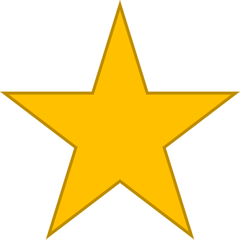

## Let's try it!

A DS11 is a good size to start with for experimentation in a notebook. We'll create the compute and ensure the dataset is available within the Azure Machine Learning workspace. 

All data scientists will get access to the workspace so they can start experimenting and train models. 

## Do you want to get started?

<button class="button" onclick="window.location.href='https://docs.microsoft.com/learn/modules/train-local-model-with-azure-mls/';">Learn how to train a model with Azure Machine Learning</button>

## Do you want to do another game?

<button class="button" onclick="window.location.href='../../00-start-training';">Go back to start to select a new scenario</button>
