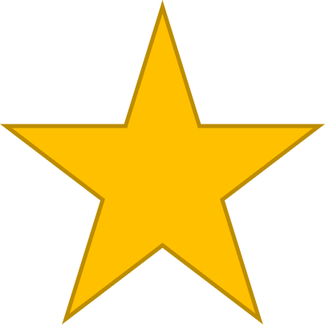

## Let's try it!

A DS11 is a good size to start with for experimentation in a notebook. As it's memory-optimized, we expect a better performance when loading and exploring data directly in the notebook. And since we're only experimenting now, we may as well go for the cheapest option. If it turns out we need more compute, we can easily scale up.

We'll create the compute and ensure the dataset is available within the Azure Machine Learning workspace. 

All data scientists will get access to the workspace so they can start experimenting and train models. 

## Do you want to get started?

[Learn how to train a model with Azure Machine Learning](https://learn.microsoft.com/learn/modules/train-local-model-with-azure-mls/)

