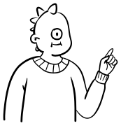

# You enter the data scientist's office...

You walk to their desk and sit down to talk:

 
Hi! I just got hired as the first data scientist and feel a bit like a fish out of water. I don't know if I can help you.

<button class="button" onclick="showContent('id01')">I'm here to help you! Which programming language are you familiar with to train machine learning models?</button>

<button class="button" onclick="showContent('id02')">How are you planning to train the model to predict diabetes in patients?</button>

  
I'm here to help you! Which programming language are you familiar with to train machine learning models?

  
I'll be honest with you... I haven't been part of large enterprise data science teams yet. So, I still use Python as that is what I've learned during my studies.

  <button class="response" onclick="window.location.href='../office-health-care';">Thank you! That's great to know. I'll talk to your colleagues to see what works best for this project.</button>

  
How are you planning to train the model to predict diabetes in patients?

  
I'd say it's pretty optimistic of you to think I have a plan. I prefer working in Jupyter notebooks to train machine learning models. I'm not very familiar with any cloud services but could learn to work with another tool I guess...
  

  <button class="response" onclick="window.location.href='../office-health-care';">Thank you! That's great to know. I'll talk to your colleagues to see what works best for this project.</button>

