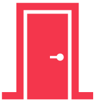

## You're in the office of Proseware

Choose who you want to talk to next. Finally, when you gathered all information, you should talk to the project manager.

  

    
      <button class="btn" onclick="window.location.href='../hc-data-scientist';">Talk to the data scientist</button>
    

    

    
      <button class="btn" onclick="window.location.href='../hc-software-engineer';">Talk to the software engineer</button>
    

  

    
      <button class="btn" onclick="window.location.href='../hc-business-user';">Talk to the business users</button>
    

    

    
      <button class="btn" onclick="window.location.href='../hc-data-engineer';">Talk to the data engineer</button>
    

  

  

    
      <button class="btn" onclick="window.location.href='../hc-end';">Talk to the project manager</button>
  
